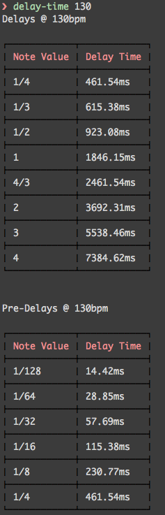

# delay-time 

> Calculates delay and predelay time for a given bpm, useful for working in a DAW


## Install

```
$ npm install --save delay-time
```


## Usage

```js
var delayTime = require('delay-time');

delayTime(120, function(err, result));
//=> result will be an object with
{
	delays: [
		{ beat: '1/4': 500 },
		...
	],
	preDelays: [
		{ beat: '1/128': 15.63 },
		...
	],
}
```


## CLI

```
$ npm install --global delay-time
```
```
$ delay-time --help

  Calculating delay and predelay time for a given bpm

  Usage
    $ delay-time [bpm]

  Examples
    $ delay-time 130

```



## API

### delayTime(bpm, cb(err, result))

#### input

*Required*  
Type: `Number`


#### cb

*Required*
Type: `function(err, result)`

## License

MIT © [Thomas Maximini](http://thomasmaximini.com)
